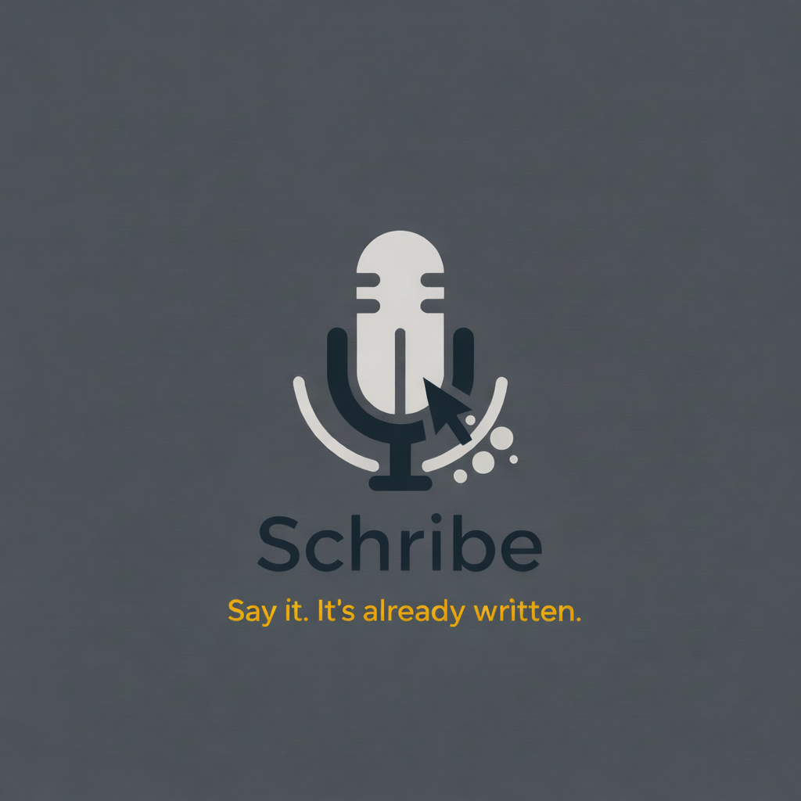
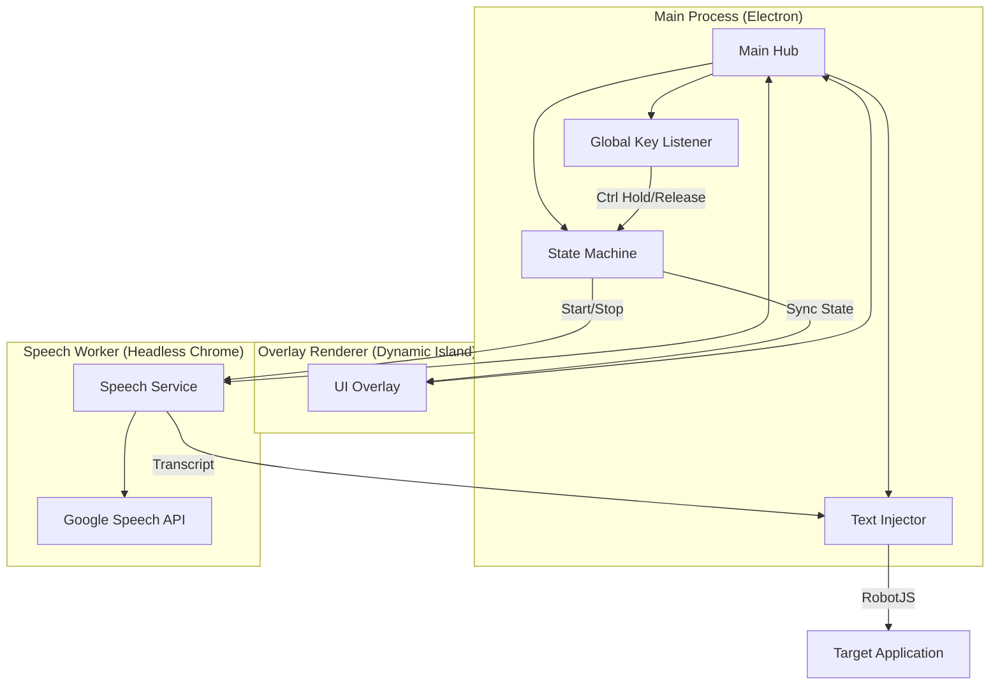

  

# Schirbe ✍️
### *Say it. It’s already written.*

**Schirbe** is a production-grade, universal dictation application designed for speed and invisibility. It integrates a seamless, **Dynamic Island-inspired UI** into your desktop workflow, allowing you to dictate text into any application instantly using simple keyboard triggers.

---

## ✨ Key Features
- **🏝️ Dynamic Island UI**: A minimal, non-intrusive overlay that sits near your taskbar/dock and reacts to your voice.
- **⚡ Zero-Focus Dictation**: Hold **Ctrl** anywhere in Windows or macOS to start talking; Schirbe handles the rest.
- **🤖 Smart Text Injection**: Intelligently decides between "Pasting" (for speed) and "Typing" (for terminals) to ensure compatibility with all software.
- **🧹 Precision Processing**: Automatic cleanup of verbal fillers (umms, uhhs), normalization of spacing, and smart capitalization.
- **🔒 Privacy First**: Runs locally using the Web Speech API; no constant background listening or cloud-stored recordings.

---

## 🏗️ System Architecture

Schirbe uses a multi-process architecture to ensure the UI stays responsive while the speech engine processes high-fidelity audio.

### 1. Main Process (`/main`)
The "brain" of Schirbe. It monitors system-level keyboard events using `uiohook-napi` and coordinates the state transitions. When a recording finishes, it uses `robotjs` to inject text directly into the user's last active window.

### 2. Dynamic Island Renderer (`/renderer`)
A transparent, non-interactive overlay. It receives state updates (ARMED, RECORDING, FINALIZING) and provides fluid visual feedback through a horizontal pill-shaped UI and voice-reactive waveforms.

### 3. Speech Bridge (`/speech-service`)
To utilize the high-performance Google Speech SDK without API costs, Schirbe launches a dedicated, sandboxed Chrome process. This worker process hosts the Web Speech API and communicates with the Main process via an authenticated WebSocket.

---

## 🧠 The State Machine

Schirbe's reliability comes from its strict 4-stage state machine:

| State | Trigger | Action | UI Feedback |
| :--- | :--- | :--- | :--- |
| **IDLE** | Release / Startup | Waiting for trigger | Hidden |
| **ARMED** | Ctrl Down | Capture active window, 200ms debounce | "Ready..." |
| **RECORDING** | Timer Finish | Ignite microphone & recognition | Waveform active |
| **FINALIZING** | Ctrl Release | Stop recognition & fetch final text | Animated dots |

---

## 🛠️ Technical Details

### Text Injection Strategy
- **Standard Apps**: Uses the system clipboard for near-instant insertion of long paragraphs.
- **Terminals**: Automatically detects shells (CMD, PowerShell, Bash) and switches to character-by-character typing to prevent buffering issues.

### Smart Correction
The built-in `processor.js` applies several filters:
- **Filler Stripping**: Removes "umm", "uhh", "err".
- **Duplicate Protection**: Flags and removes accidental word repetitions.
- **Terminal Cleaning**: Converts spoken commands into executable-friendly patterns.

---

## 📦 Installation & Setup

### For Users
Schirbe is cross-platform. You can download the latest installers from the [Releases](https://github.com/SAIROHITH/Schirbe/releases) page.
- **Windows**: Run `Schirbe Setup.exe`.
- **macOS**: Drag `Schirbe.dmg` to Applications and enable **Accessibility** + **Microphone** permissions.

### For Developers
1. Clone the repository.
2. Install dependencies: `npm install`.
3. Rebuild native modules: `npm run postinstall`.
4. Start development: `npm start`.
5. Build production: `npm run build`.

---

## 📜 License
ISC License - Feel free to use and modify for personal or commercial productivity.
